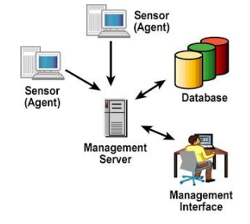
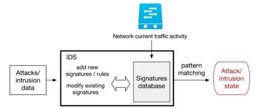
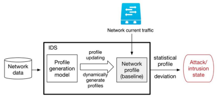
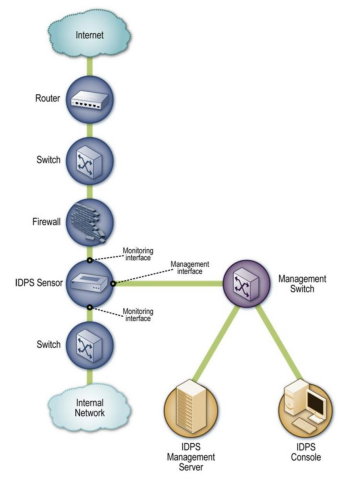
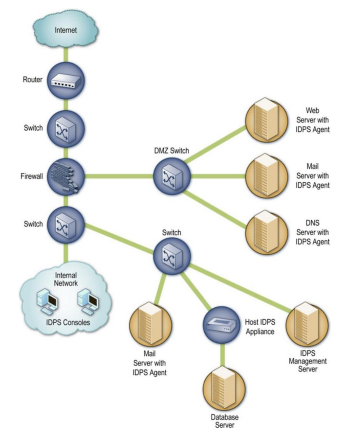
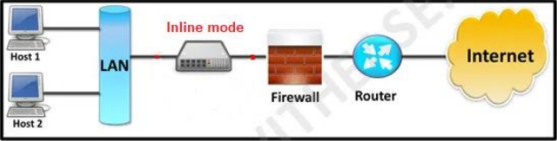
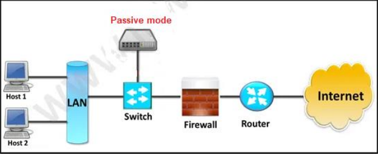
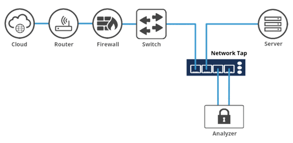
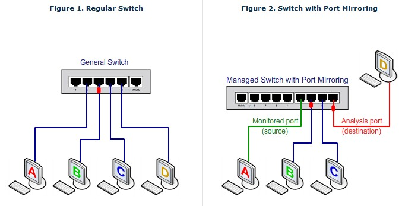

## Introduction 

Bài viết này mình sẽ viết về những gì mình biết về **Intrusion Detection and Prevention System (IDPS)** trong quá trình học ở UIT và research trên mạng. 

**Hệ thống tìm kiếm, phát hiện và ngăn ngừa xâm nhập (IDPS)** chủ yếu tập trung vào xác định các sự cố có thể xảy ra, ghi nhận các thông tin liên quan, cố gắng ngăn chặn và báo cáo cho các quản trị viên bảo mật. Mục tiêu là để đảm bảo an toàn cho mạng và hệ thống máy tính theo **bộ ba CIA**.

Các thành phần chính của một IDPS bao gồm:

- **Sensor** là thiết bị hoặc phần mềm đặt trên mạng để theo dõi và phân tích lưu lượng mạng nhằm phát hiện hoặc ngăn chặn xâm nhập. Nó thuộc **Network-based IDPS**.
- **Agent** là phần mềm nhỏ được cài đặt trực tiếp trên máy (server, máy trạm) để theo dõi hoạt động bên trong máy đó. Nó thuộc **Host-based IDPS**.
- **Management server** là thiết bị trung tâm nhận các thông tin từ các sensor hoặc agent để quản lý.
- **Database** là nơi lưu trữ các thông tin sự kiện theo dõi được bởi các sensor hay agent và management server (optional).
- **Management Interface (Console)** là chương trình cung cấp giao diện GUI (or CLI) cho user hoặc admin để tương tác với IDPS.

## Phân loại IDPS

**IDPS** được phân loại dựa trên 2 tiêu chí: các kĩ thuật phát hiện tấn công và nguồn dữ liệu.

### Dựa trên các nguồn dữ liệu tấn công

#### Signature-Based Detection

**Signature** là một mẫu tương ứng với một nguy cơ tấn công (database về các cuộc tấn công đã được biết trước).

Kĩ thuật phát hiện **Signature-Based** (hay còn gọi là *Knowledge-based*) là một quá trình so sánh các signature với các sự kiện quan sát được để xác định các sự cố có thể có.

Example:
-  Một kết nối **telnet** với `username = root` là dấu hiệu vi phạm chính sách bảo mật của một tổ chức.
- Một email với tiêu đề **"Free pictures!"** và có tên file đính kèm **freepics.exe** là đặc điểm của một malware đã biết.

Mô hình kiến trúc:

- **Ưu điểm**: độ chính xác cao đối với các cuộc tấn công đã biết, tỉ lệ *false positive* thấp.
- **Nhược điểm**: không thể phát hiện các hành vi bất thường chưa biết trước hoặc các biến đổi nhỏ trong những tấn công đã biết. Việc triển khai và update signature khó và tốn thời gian.

#### Anomaly-Based Detection

**Anomaly-Based** *(hay profile-based)* hoạt động dựa trên việc: tạo ra một profile cơ sở đại diện cho các hành vi bình thường/dự kiến trong mạng. Dựa vào đó, bất kỳ hoạt động mạng đang xem xét nào có sai khác so với profile này đều bị xem xét là bất thường. 

**Profiles** dại diện cho hoạt động mạng bình thường hầu hết được tạo ra thông qua phân tích lịch sử lưu lượng mạng (qua các hàm thống kê, machine learning, clustering, fuzzy logic, ...)

Mô hình kiến trúc:

- **Ưu điểm:** phát hiện được cả các hành vi bất thường đã biết và chưa biết, không cần phải có hiểu biết trước. Phát hiện được các tấn công mới (về sau có thể sử dụng trên các Signature-Based IDS).
- **Nhược điểm:** tỉ lệ *false positive* cao, ít hiệu quả trong các môi trường mạng rộng, thay đổi nhiều. Yêu cầu thời gian và tài nguyên để build được profile đại diện cho mạng.

#### Specification-Based

**Specification-Based** thu thập các hoạt động chính xác của một chương trình hoặc giao thức và theo dõi hoạt động của nó dựa trên các ràng buộc. Sử dụng mô hình giao thức chủ yếu dựa trên các chuẩn giao thức từ các nhà sản xuất phần mềm và tiêu chuẩn (IEFT, RFC)

- **Ưu điểm:** Xác định được các chuỗi lệnh bất thường, kiểm tra được tính hợp lý của từng câu lệnh. Tỷ lệ *false positive* thấp.
- **Nhược điểm:** Khó, thậm chí không thể phát triển các mô hình giao thức chính xác hoàn toàn. Phức tạp, tốn tài nguyên và thời gian.

#### Hybrid

**Hybrid IDS** hay còn gọi là *Compound Detection*, kết hợp các kỹ thuật phát hiện dựa trên signature, anomaly, và specification.

- **Ưu điểm:** Đối phó được với các thay đổi tinh vi trong tấn công. Tích hợp được lợi ích của cả 3 kĩ thuật trên. Khắc phục được nhiều nhược điểm.
- **Nhược điểm:** Bị giới hạn phạm vi vào hoạt động của một chương trình, giao thức. Cần tích hợp sao cho 3 kỹ thuật riêng biệt có thể cùng tương tác và hoạt động trong cùng một hệ thống.

### Dựa trên nguồn dữ liệu

#### Network-Based IDPS (NIDPS)

**Network-based IDPS (NIDPS)** theo dõi lưu lượng mạng cho một phần của mạng (network segment) hoặc các thiết bị, phân tích các hoạt động mạng và các giao thức, ứng dụng để xác định các hành vi bất thường. 

Thường được triển khai ở biên mạng, gần firewall hoặc router biên, server VPN, server remote access và mạng không dây.

Gồm nhiều **sensor** đặt ở nhiều điểm khác nhau trong mạng để theo dõi traffic mạng.

#### Host-Based IDPS (HIDPS)

**Host-based IDPS (HIDPS)** theo dõi các đặc điểm của một host riêng lẻ và các sự kiện xảy ra trong host đó để phát hiện hoạt động bất thường. 

Theo dõi lưu lượng mạng của các host, system log, các process đang chạy, các hoạt động ứng dụng, truy cập và thay đổi file, ...

Được triển khai trên host quan trọng (các server có thể truy cập từ bên ngoài, các server chứa thông tin quan trọng).

#### Hybrid IDPS

**Hybrid IDPS** được phát triển để hướng đến xem xét tất cả dữ liệu từ các sự kiện trên host và sự kiện trong các phần mạng, kết hợp chức năng của cả network và host-based IDPSs.

- Tích hợp các ưu điểm của cả 2 kỹ thuật trên.
- Cần tích hợp sao cho 2 kỹ thuật riêng biệt có thể cùng tương tác và
hoạt động trong cùng một hệ thống.

## Architecture of IDPS

Các thành phần của **IDPS (sensor, agent, management server, database, console)** phải giao tiếp với nhau để gửi cảnh báo, cập nhật rule, đẩy cấu hình. Đây là **traffic quản lý**, nó rất nhạy cảm vì nếu attacker kiểm soát được kênh này, họ có thể tắt sensor, sửa rule, xóa log hoặc làm giả cảnh báo. Vì vậy ta cần quyết định traffic quản lý này đi theo hướng nào.

### Out-of-band

Sensor có 2 card mạng: một card nghe traffic (không gán IP), một card nối vào mạng quản lý riêng.

- **Ưu điểm:** an toàn nhất, traffic quản lý không bị lẫn với traffic bị giám sát.
- **Nhược điểm:** tốn thêm nhiều switch, cáp, port, chi phí cao.

### VLAN

Dùng chung hạ tầng vật lý nhưng traffic quản lý nằm trong VLAN riêng.

- **Ưu điểm:** rẻ, dễ triển khai.
- **Nhược điểm:** kém an toàn hơn. Cấu hình sai switch hoặc tấn công **VLAN hopping** có thể làm lộ kênh quản lý.

### In-band

Traffic quản lý đi cùng mạng với traffic bình thường. 

- **Ưu điểm:** đơn giản, không tốn thêm gì.
- **Nhược điểm:** rủi ro cao nhất, dễ bị sniffing hoặc tấn công trực tiếp vào IDPS. Chỉ nên dùng khi bắt buộc, và phải mã hóa kênh.

## Deep dive in NIDPS

Phần này mình sẽ đi sâu hơn về mô hình **Network-based IDPS**.

Các thành phần chủ yếu: sensor, management server, console, database (optional).

**Card mạng (NIC)** được đặt ở *promiscuous mode* để theo dõi được toàn bộ lưu lượng mạng. Thông thường NIC sẽ bỏ qua các gói tin không gửi đến nó (khác MAC address). Khi hoạt động ở *promiscuous mode*, NIC sẽ chuyển tất cả các frame nhận được từ mạng đến kernel. Nếu một sniffer đã đăng kí với kernel, nó có thể thấy tất cả các frame đó.

### Kiến trúc và vị trí đặt sensor

Các sensor có thể được triển khai ở 2 mode: **inline sensor** hoặc **passive sensor**.

#### Inline sensor

**Inline sensor:** lưu lượng mạng được theo dõi đều phải đi qua sensor đó, tương tự như lưu lượng mạng đi qua firewall. Cho phép ngăn chặn tấn công bằng cách chặn lưu lượng mạng.

Một vài inline sensor là thiết bị **lai firewall/IDPS (A)** hoặc **chỉ là IDPS (B)**.

- **(A)** thường được đặt tại vị trí của firewall mạng và các thiết bị bảo mật mạng khác (giữa các mạng, biên mạng).
- **(B)** thường được đặt ở một phía an toàn hơn của phần mạng để có ít traffic phải xử lí hơn.

#### Passive sensor

**Passive sensor** chỉ được theo dõi bản sao của lưu lượng mạng; không có lưu lượng thực tế nào đi qua sensor.

Chúng thường được đặt ở các vị trí quan trọng trong mạng (vị trí chia giữa các mạng) hoặc các segment mạng quan trọng (như vùng **DMZ**).

#### Các phương pháp theo dõi mạng

##### Network TAPs (Terminal Access Point)

- Kết nối trực tiếp giữa các sensor và đường truyền vật lí.
- Cung cấp bản sao các lưu lượng mạng trên đường truyền.
- **Fail-safe**: cơ chế tự động chuyển traffic mạng về bình thường nếu như TAP bị hỏng hoặc mất kết nối.
- **Nhược điểm:** cần thêm chi phí trang bị.

##### Switch Port Mirroring 

- Switch sao chép các frame của một hoặc nhiều port gửi đến **SPAN (Switch Port Analyzer)**, có thể kết nối với thiết bị phân tích.
- **Nhược điểm:** SPAN port có thể không thấy được tất cả lưu lượng nếu cấu hình sai hoặc đang quá tải.

### Khả năng bảo mật

#### Thu thập thông tin

Các IDPS có thể thu thập cả thông tin trên host và các hoạt động mạng chứa các host đó. Nó có thể:
- Xác định các host dựa trên IP và MAC address.
- Xác định thông tin hệ điều hành OS: theo dõi các port được sử dụng, phân tích header của packet, xác định phiên bản sử dụng.
- Xác định các ứng dụng: theo dõi các đặc điểm của các giao tiếp ứng dung.
- Xác định các đặc điểm của mạng: ví dụ số lượng *hop* giữa 2 thiết bị.

#### Ghi log

IDPS có thể ghi lại các trường thông tin điển hình:
- Timestamp
- ID của connection/session
- Sự kiện hoặc loại cảnh báo (thường liên kết đến các CVEs)
- Xếp hạng các event (mức ưu tiên, mức quan trọng, ảnh hưởng, độ tin cậy).
- Các protocol ở tầng Network, Transport, và Application
- Souce IP, Dest IP, port, code ICMP, ...
- Số byte đã được truyền qua kết nối
- Dữ liệu payload đã giải mã
- Các hoạt động ngăn chặn đã được thực hiện (nếu có)

#### Phát hiện tấn công

Các dạng sự kiện có thể detect: 
- **Do thám và tấn công ở tầng Application** (vd: banner grabbing, buffer overflows, format string, dò/đoán password, malware...)
- **Do thám và tấn công ở tầng Transport** (vd: port scanning, packet fragmentation, SYN floods...)
- **Do thám và tấn công ở tầng Network** (vd: giả mạo IP address, giá trị IP header không hợp lệ...) 
- **Các dịch vụ ứng dụng bất thường** (vd: backdoor, host chạy các dịch vụ ứng dụng trái phép...)
- **Vi phạm chính sách** (vd: sử dụng website không phù hợp, sử dụng giao thức bị cấm...)

Độ chính xác: 