> Tái cấu trúc từ series **[Windows Forensic] Registry Analysis** của RE Team — VNPT Cyber Immunity (29-04-2021):
> [Part 1](https://sec.vnpt.vn/2021/04/windows-forensic-registry-analysis-part1) · [Part 2](https://sec.vnpt.vn/tin-tuc/blog/windows-forensic-registry-analysis-part2)

## What is Registry?

**Registry** có thể được coi như một cơ sở dữ liệu có cấu trúc của Windows. Registry được sử dụng để lưu trữ thông tin cấu hình, cài đặt của hệ điều hành và cả của các services và ứng dụng. Vì vậy, nó là một nguồn thông tin hữu ích của các chứng cứ trên máy tính.

Nhưng có một lưu ý rằng không phải là tất cả các ứng dụng đều sử dụng registry để lưu cấu hình, cài đặt của nó, một số chương trình sử dụng tập tin `.XML` hay `.INI` để lưu cấu hình.

Ngoài ra Registry còn hỗ trợ cấu trúc multi-profile lưu trữ cài đặt của người dùng, mỗi người dùng sẽ có cấu hình khác nhau dành riêng cho tài khoản của họ, một ví dụ đơn giản như là UserA cài đặt Unikey khởi động cùng Windows còn UserB thì không cài chương trình đó, Registry sẽ ghi lại những điều này và lưu vào thư mục riêng của mỗi người dùng. Chúng ta sẽ thảo luận chi tiết hơn về điều này ở phần sau.

## Registry Structure

Trên HĐH Windows ta có thể sử dụng **Registry Editor**:

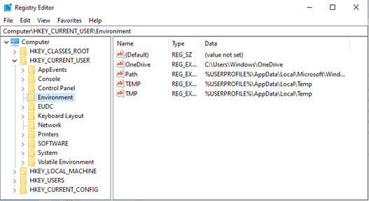

**Registry** có cấu trúc cụ thể, được chia thành 2 thành phần: **key** và **value**. Trong đó key giống như folder, một key có thể chứa thêm nhiều key hoặc chứa các value. Đường dẫn đi từ key cha sang key con hơi giống với đường dẫn của thư mục trong Windows và tên của nó không quan trọng có viết hoa hay thường. Có một số thuật ngữ cần lưu ý:

- **Root key**: Trong Windows từ Win8.1 có năm *root keys*, mỗi *root key* có một mục đích cụ thể. Mỗi root key đều bắt đầu bằng tiền tố *HKEY*. Lưu ý: *hive* dùng để gọi file của một nhánh registry lưu trên đĩa — xem thêm mục **System Hives**.
- **Subkey**: *subkey* giống như một thư mục con trong một thư mục.
- **Key**: *Key* là một thư mục trong registry có thể chứa các giá trị hoặc thư mục bổ sung. Cả root key và subkey đều là key.

Ví dụ:

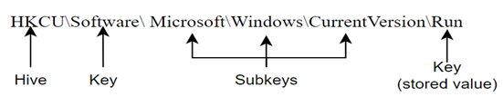

`HKCU\Software\Microsoft\Windows\CurrentVersion\Run`, chứa một loạt các giá trị là file thực thi được khởi động tự động khi người dùng đăng nhập. **Root key** là *HKCU (HKEY_CURRENT_USER)*, key này lưu trữ các **Subkey**: `SOFTWARE`, `Microsoft`, `Windows`, `CurrentVersion` và `Run`. Và **Key** `Run` chứa các *Value*.

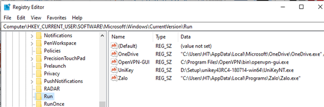

Với mỗi root key nói riêng và các key nói chung, sẽ chỉ có những phần mềm nhất định được truy cập vào vì lý do bảo mật. Chính vì thế mà mỗi người dùng, phần mềm, dịch vụ sẽ chỉ thấy những key mà chúng được phép xem mà thôi.

Mỗi value có ba thành phần: **Name**, **Type** và **Data**, ví dụ như trong hình trên. Tiếp theo là một số Type của value:

- `REG_NONE`: Không có loại
- `REG_SZ`: Chuỗi kí tự bất kì
- `REG_BINARY`: Dữ liệu dạng nhị phân
- `REG_DWORD`: Một số 32-bit

## Registry Root Keys

Registry được chia thành 5 root key:

- **HKEY_LOCAL_MACHINE (HKLM)**
- **HKEY_CURRENT_USER (HKCU)**
- **HKEY_USERS (HKU)**
- **HKEY_CLASSES_ROOT (HKCR)**
- **HKEY_CURRENT_CONFIG (HKCC)**

Hai root key được sử dụng phổ biến nhất là **HKLM** và **HKCU**. Một số key là **khóa ảo** cung cấp cách tham chiếu thông tin registry.

### HKEY_LOCAL_MACHINE

Chứa thông tin cấu hình, cài đặt của máy tính. Rootkey này dùng cho bất kỳ user nào. Rootkey này có 5 subkeys chính:

- **System**: Chứa cấu hình hệ thống, chẳng hạn như computer name, system time zone, network interfaces.
- **Software**: Chứa cài đặt, cấu hình về những ứng dụng được cài đặt trên hệ thống và những services của hệ điều hành.
- **SAM**: Security Account Manager, chứa thông tin bảo mật về user và group.
- **Security**: Chứa chính sách bảo mật của hệ thống.
- **Hardware**: Thông tin về thiết bị hardware kết nối tới hệ thống. Những thông tin này được lưu trữ trong suốt quá trình hệ thống khởi động.

### HKEY_CURRENT_USER

Lưu những thông tin cho người dùng đang đăng nhập. Các thư mục, màu màn hình, cài đặt Control Panel được lưu trữ tại đây. Thông tin này được liên kết với profile của user. Nó là nhánh con của HKEY_USERS.

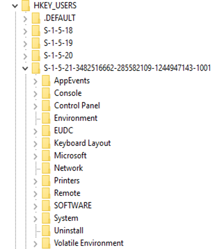

### HKEY_USERS

Lưu những thông tin của tất cả các user, mỗi user là một nhánh với tên là số ID của user đó. Hãy cùng xem ví dụ sau đây:

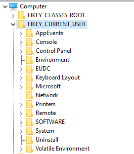

- **Default**: Đây là cấu hình mặc định cho bất kỳ user nào và nó nằm tại `%SystemDrive%\Users\Default`
- **S-1-5-18**: Đây là system profile và nó nằm tại `%systemroot%\system32\config\systemprofile`
- **S-1-5-19**: Liên quan đến LocalService nằm tại `%systemroot%\ServiceProfiles\LocalService`
- **S-1-5-20**: Liên quan đến NetworkService tại `%systemroot%\ServiceProfiles\NetworkService`
- **S-1-5-21-3482516662-285582109-1244947143-1001**: Đây chính là người dùng hiện đăng nhập với SID đầy đủ của họ. Và nó nằm tại `C:\Users\<username>`.
- Còn mục **S-1-5-21-3482516662-285582109-1244947143-1001-Classes** chính là phần chúng ta đã nhắc tới trong HKEY_CLASSES_ROOT.

### HKEY_CLASSES_ROOT

Rootkey này chứa các subkey, mỗi subkey được đặt tên theo một extension có thể được tìm thấy trong hệ thống, chẳng hạn như `.exe` hay `.evtx`, … Dựa vào những key này chúng ta có thể biết được chương trình nào được sử dụng để mở một định dạng file cụ thể, ví dụ như với file có `.evtx` extension sau đây:

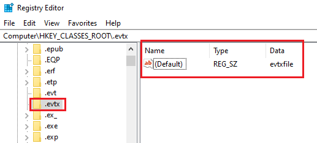

Như trong hình trên, keyname **.evtx** có value data là “**evtxfile**”. Sau đó chúng ta tìm kiếm subkey có subkey name liên quan đến “**evtxfile**”:

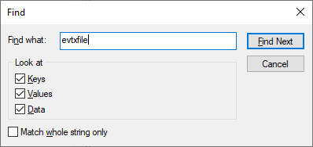

Kết quả cho ta một key có tên **evtxfile** nằm trong cùng rootkey **HKCR**. Với kết quả tìm được, có thể xác định chương trình nào đã được sử dụng để chạy file dạng `.evtx` và ở trường hợp này chính là **Event Viewer**, nó còn cho biết vị trí trong filesystem:

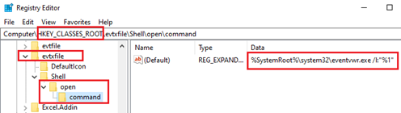

Thực chất, những thông tin trong rootkey **HKCR** này được lấy từ hai nguồn:

- `HKEY_LOCAL_MACHINE\Software\Classes`
- `HKEY_CURRENT_USER\Software\Classes`

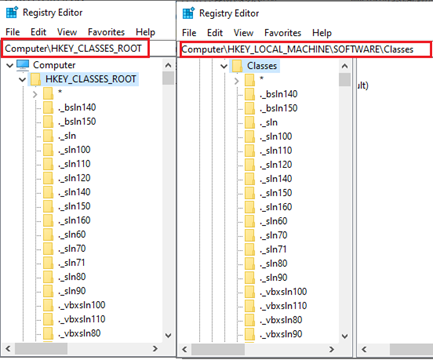

Thông thường **HKCR** chỉ ánh xạ từ `HKLM\Software\Classes`, đây có thể coi như là mặc định nhưng nếu user cụ thể nào đó sử dụng một chương trình khác để mở một định dạng file `HKCU\Software\Classes` sẽ được sử dụng và chỉ liên kết với user cụ thể đó.

Ví dụ khi user sử dụng chương trình khác nhau để mở file PDF, khi user đăng nhập vào hệ thống, hệ điều hành sẽ load profile của user đó bao gồm cả tùy chọn chương trình để mở file PDF mà họ đã cài đặt và lúc này chính là trong `HKCU\Software\Classes`.

### HKEY_CURRENT_CONFIG

Lưu thông tin về **hardware profile hiện tại** của máy. Theo tài liệu [Microsoft](https://learn.microsoft.com/en-us/windows/win32/sysinfo/predefined-keys), **HKCC** thực chất chỉ là một **alias** (khóa ảo) trỏ tới `HKEY_LOCAL_MACHINE\System\CurrentControlSet\Hardware Profiles\Current` — nó không lưu dữ liệu riêng mà chỉ "nhìn" vào phần cứng đang dùng.

Nội dung dưới **HKCC** chỉ mô tả phần **chênh lệch giữa cấu hình phần cứng hiện tại và cấu hình chuẩn**, phần chuẩn được lưu ở **`Software`** và **`System`** của **HKLM**. Những thứ thường gặp ở đây là cài đặt theo profile như độ phân giải màn hình hay máy in — ví dụ đổi dock hay cắm màn hình ngoài thì hardware profile đổi theo.

Với người điều tra, **HKCC** thường có giá trị thấp nhất trong 5 root key: nó gần như chỉ ghi phần khác biệt của hardware profile, không chứa cấu hình hệ thống hay phần mềm — những thứ đó đã nằm ở **HKLM** và **HKCU** rồi.

## System Hives

Ở phần trên, chúng ta đã biết được vấn đề Registry là gì và cấu trúc của nó. Đó là những gì thể hiện trên Registry Editor để dễ dàng đọc và chỉnh sửa nhưng thực chất dữ liệu nằm ở đâu, phần tiếp theo chúng ta sẽ đi tìm hiểu vị trí lưu Registry.

**Windows Registry** không đơn giản là một file mà là một tập hợp các file riêng lẻ, gọi là **hive**. Mỗi **hive** chứa một nhánh Registry. Hầu hết được lưu trong thư mục `Windows\System32\Config`. Cụ thể:

- HKEY_LOCAL_MACHINE\SYSTEM: `\system32\config\system`
- HKEY_LOCAL_MACHINE\SAM: `\system32\config\sam`
- HKEY_LOCAL_MACHINE\SECURITY: `\system32\config\security`
- HKEY_LOCAL_MACHINE\SOFTWARE: `\system32\config\software`

Các **registry hives** này là **DEFAULT, SAM, SECURITY, SOFTWARE** và **SYSTEM**. Các tệp tương ứng với ý nghĩa của chúng trong **registry**.

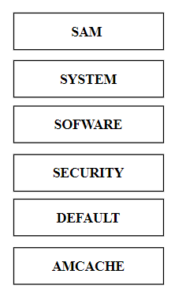

Tất cả các tệp hệ thống sẽ nằm trong **HKEY_LOCAL_MACHINE**, chúng chứa thiết lập hệ thống, tệp khởi động, cấu hình máy và các tệp mặc định khác.

## User Registry Hives

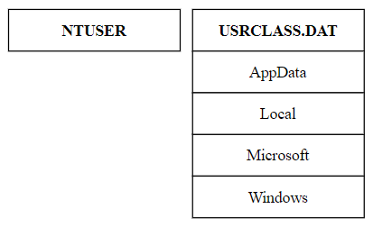

- Đối với hệ thống máy tính có nhiều user. Mỗi user đều sẽ có một registry hive riêng.
- Registry hive theo từng cá nhân sẽ cung cấp cho chúng ta thông tin về hoạt động của họ trên máy tính và đây là một thông tin rất quan trọng trong điều tra số.

### `NTUSER.DAT`

Vị trí của file trên các OS:

- `C:\Documents and Settings\<username>\NTUSER.dat` (XP)
- `C:\Users\<username>\NTUSER.dat` (Win7-Win10)

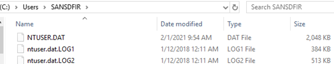

Như đã đề cập, trong mỗi tài khoản người dùng là một file có tên `NTUSER.DAT`. File này chứa các cài đặt và tùy chọn cho mỗi người dùng riêng biệt. Mỗi khi ta có thao tác nào đó cài đặt chương trình mới nào đó, hay các tùy chọn như đặt mặc định cho một máy in mới, Windows sẽ cần ghi nhớ tùy chọn đó của ta vào lần tải tiếp theo.

Đầu tiên những thông tin mới này sẽ được lưu vào **HKEY_CURRENT_USER**. Và sau đó, khi ta tắt máy hay đăng xuất, những thông tin đó sẽ được lưu vào file `NTUSER.DAT`. Và vào lần đăng nhập sau đó, Windows sẽ tải `NTUSER.DAT` vào bộ nhớ và tất cả các tùy chọn của ta sẽ tải lại vào Registry.

Registry có thể được sử dụng để liệt kê các tệp được sử dụng gần đây nhất, các tệp cuối cùng đã tìm kiếm trên ổ cứng, các URL được nhập cuối cùng mà người dùng đã nhập vào windows trình duyệt của mình. Nó cũng có thể hiển thị các lệnh cuối cùng được thực thi trên hệ thống cũng như các tệp đã được mở, …

### `USRCLASS.DAT`

Trong Win7-Win10, file này nằm tại:

`C:\Users\<username>\AppData\Local\Microsoft\Windows\USRCLASS.DAT`

Hive chứa một số thông tin chính liên quan đến thông tin thực thi của chương trình. Key này sẽ cho chúng ta cho biết rằng liệu người dùng đã mở hay đóng thư mục nào đó chưa?.

Mục đích chính của `UsrClass.dat` là hỗ trợ registry root ảo hóa cho **User Account Control (UAC)**.

---

## Tools & Sample Collection

### Registry Editor & Registry Explorer

Trước khi đi vào phân tích một Registry key nào đó, chúng ta phải chuẩn bị một số công cụ hữu ích giúp ta trong quá trình phân tích. Có khá nhiều công cụ có thể view registry nhưng mình thường sử dụng ngay **Registry Editor** mặc định trên Windows và **Registry Explorer** của tác giả Eric Zimmerman khi phân tích các registry “offline” sau khi thu thập được, Registry Explorer còn hỗ trợ decode một giá trị registry cho người phân tích một view khá dễ hiểu. Ta có thể tải **Registry Explorer** tại: [đây](https://ericzimmerman.github.io/#!index.md)

Giao diện Registry Editor trên Windows:

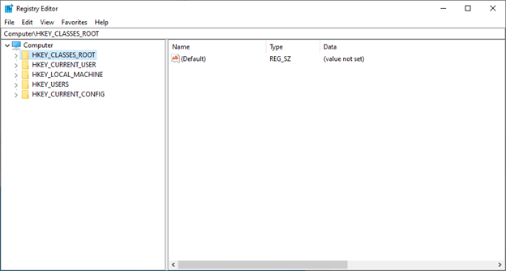

Còn Registry Explorer sẽ có giao diện như sau:

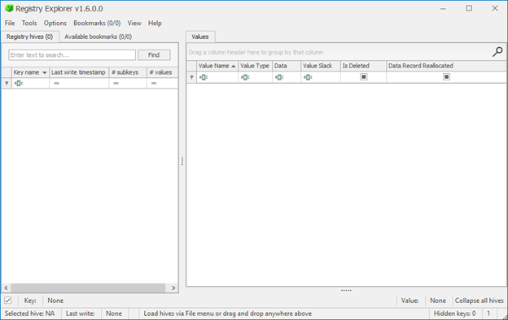

Để sử dụng Registry Explorer khá đơn giản, ta chỉ cần import các file đã thu thập được vào bằng cách ấn **File** trên thanh taskbar và chọn **Loadhive**.

### CDIR Collector

Còn làm thế nào để có file mẫu để phân tích, đơn giản nhất ta có thể thử ngay trên máy tính của mình hay một máy ảo nào đó. Có thể sử dụng các công cụ thu thập như **FTK Image** nếu như nó yêu cầu ta phải biết được mình cần thu thập gì, nằm ở đâu. Ngoài ra để đơn giản hơn ta có thể sử dụng bộ tools **CDIR Collector** nó sẽ tự động thu thập những file cần thiết để người điều tra phân tích, và mình cũng rất hay sử dụng công cụ này. (Link tải tools **CDIR Collector**: [https://github.com/CyberDefenseInstitute/CDIR](https://github.com/CyberDefenseInstitute/CDIR)). ta chỉ cần click chuột phải và chọn *Run as administrator* và đợi công cụ tự động thu thập cho chúng ta.

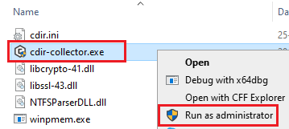

Sau khi chạy xong, sẽ thu được một thư mục chứa các thư mục con như hình dưới và bao gồm cả các Registry mà chúng ta đang cần:

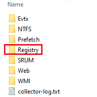

Thư mục Registry kia sẽ bao gồm các hive và ví dụ như hình dưới:

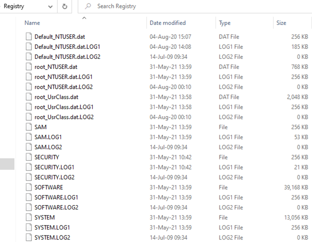

Và bây giờ ta chỉ cần mở Registry Explorer và import các hive này vào và tiến hành phân tích. Chẳng hạn như dưới đây mình đã load **SAM** hive và sẽ nhận được như sau:

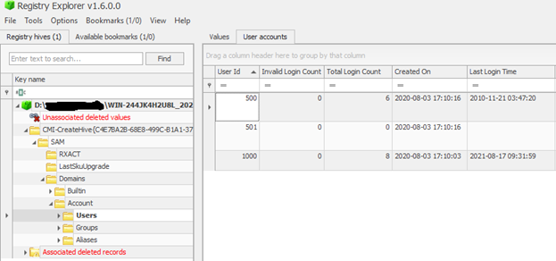

### Timestamp Decoding

Một công cụ nữa để decode các giá trị thời gian mình dùng là **DCode**, và ngay trên Registry Explorer cũng có thể decode được một số các giá trị thời gian nhưng không phải tất cả, vì vậy ta có thể kết hợp cả hai.

Ví dụ:

Trong registry key `HKLM\SYSTEM\ControlSet001\Control\Windows` ở trường Value Name `ShutdownTime` thể hiện thời gian tắt máy tính. Chuỗi giá trị này thể hiện cho một mốc thời gian nào đó, và để decode nó chúng ta cần xác định xem nó thuộc định dạng nào, điều này mình sẽ phân tích ở những value data gặp ở các registry khác sau, nhưng cơ bản ta có thể xác định nó thuộc định dạng bao nhiêu bit và từ đó có thể thử một số định dạng thời gian tương ứng với số bit đó. Ví dụ ta thấy ở đây có 1 dãy hex 16 ký tự (64bit) và ở đây nó thuộc định dạng **Windows FileTime 64 bit**:

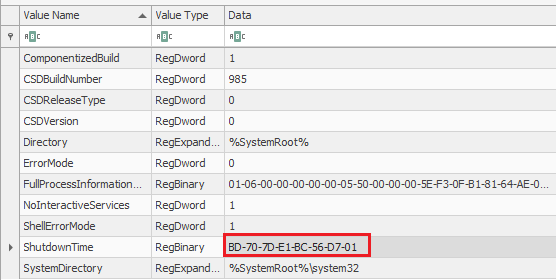

Convert value data này sang định dạng *Windows 64 bit – Little Endian* ta sẽ có thời gian máy tính bị tắt gần nhất. Có thể chuột phải vào value data `BD707DE1BC56D701` và chọn Data Interpreter:

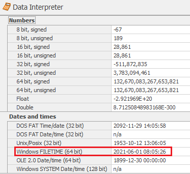

Hoặc dùng công cụ **DCode**:

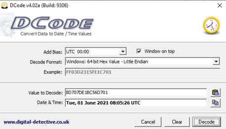

Vậy là về cơ bản ta đã chuẩn bị cơ bản để tiến hành phân tích kĩ hơn các registry key.

---

## Transaction Logs & RegBack

### Transaction Logs

Bây giờ mình sẽ thử tiến hành import một hive vào Registry Explorer:

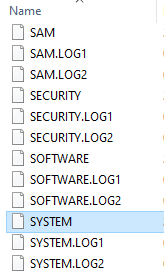

Mình thử import hive SYSTEM vào và nhiều trường hợp ngay sau đó xuất hiện thông báo:

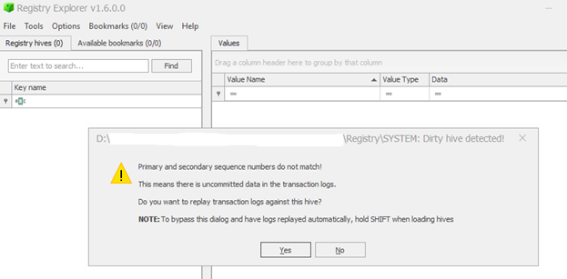
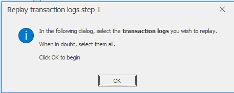

Thông báo nhắc ta replay thêm các “transaction logs”. Vậy “transaction logs” là gì mà cần chúng ta lại phải cần thêm chúng?

Nó chính là những tập tin có đuôi `.LOG1` và `.LOG2`:

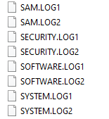

Những tập tin này nằm cùng thư mục chứa hive cùng tên. Khi có một thay đổi nào đó liên quan đến registry, Windows sẽ không ghi trực tiếp vào trong hive mà sẽ lưu vào trong các tệp tin .LOG này sau đó mới được ghi vào Hive chính. Ví dụ khi ta có thay đổi nào đó liên quan đến cấu hình hệ thống và cần phải sửa đổi các giá trị registry, Windows sẽ ghi những thay đổi đó vào các tệp `SYSTEM.LOG1` và khi ta khởi động lại, hay tắt máy tính những thay đổi trong file này sẽ được cập nhật vào lại trong SYSTEM hive.

Vì thế những file này cũng có thể chứa những thông tin quan trọng và người điều tra không được bỏ qua chúng.

Lưu ý: khi import vào Registry Explorer ta có thể giữ phím SHIFT và chọn cả 3 file gồm hive và 2 file `.LOGX` hoặc làm như những hình trên theo thông báo mà Registry Explorer đưa ra.

### Backup Hives (RegBack)

Vị trí file: `System32\Config\RegBack`

File này cũng chứa các hive như SAM, SYSTEM, SOFTWARE, SECURITY và DEFAULT.

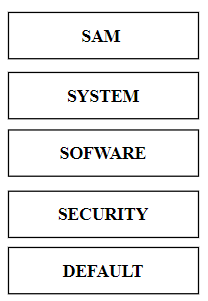

Windows sẽ tự động sao chép các SAM, DEFAULT, SYSTEM, SOFTWARE và SECURITY theo định kỳ 10 ngày một lần vào `System32\Config\RegBack` (`%WinDir%\repair` đối với Win XP).

> **Lưu ý:** Từ **Windows 10 version 1803**, Windows không còn tự động sao chép registry vào `RegBack` nữa ([Microsoft](https://learn.microsoft.com/en-us/troubleshoot/windows-client/installing-updates-features-roles/system-registry-no-backed-up-regback-folder)) — trên các máy Win10/11 đời mới, thư mục này thường rỗng và gần như không có giá trị điều tra.

Những bản backup này ngoài việc có thể khôi phục lại khi gặp sự cố bất thường nào đó, chẳng hạn việc so sánh chúng với các Registry Hive hiện tại có thể thấy sự khác nhau, đó chính là những thay đổi của bản cũ và bản mới, và đôi khi điều đó cũng có thể cho người điều tra thông tin hữu ích.

Nhưng registry này cũng không sao chép tất cả các hives, nó sẽ không sao chép NTUSER.DAT hive của người dùng cục bộ.

## Key Analysis Techniques

### Last Write Time

Một trong những điều sẽ giúp ích cho người điều tra rất nhiều là để ý đến **Last Write Time** của registry key. Thực tế là mỗi registry key đều sẽ có **Last Write Time** và giá trị này được hiển thị theo mốc thời gian **UTC**.

Khi một khóa được cập nhật, thay đổi hay thêm mới thì giá trị Last Write Time cũng sẽ được cập nhật. Dựa vào thời gian ghi cuối cùng này, người điều tra có thể xác định thời gian một key có bị thay đổi trong tương ứng với các mốc thời gian với các sự kiện có liên quan đến sự cố của họ hay không. Việc xác định, lập được các mốc thời gian cũng giúp chúng ta không bị quá lan man, đi sâu vào những key không cần thiết, tiết kiệm được thời gian đáng kể.

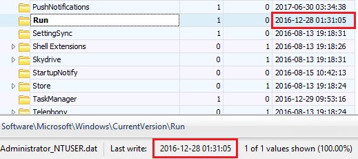

Với Registry Explorer ta có thể xác định Last Write Time của key tại những vị trí trong hình.

### MRUList

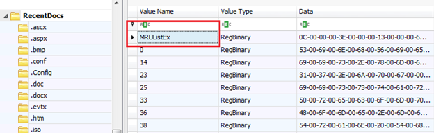

MRU là viết tắt của **Most Recently Used**. Chẳng hạn như ta gặp một key có vài chục đến cả trăm value key, nhưng lại không xác định được cái nào được tạo trước, cái nào tạo sau, việc này có thể gây nhầm lẫn hay làm phức tạp quá trình điều tra, vì vậy MRUList khá hữu ích trong quá trình điều tra

Nó cung cấp cho chúng ta thông tin về thứ tự các value key được thêm vào key. Việc xác định thứ tự value key nào được thêm vào key khá quan trọng, chẳng hạn như ta có thể sẽ biết được thứ tự hành vi nhất định của người dùng.

MRUList là một danh sách các giá trị **4 byte**, số lượng giá trị này tùy thuộc vào từng key và có thể lên tới **150 giá trị** như trong RecentDocs.

Như ví dụ trong hình, thứ tự sẽ là `0C`, `3E`, `13`… và ta sẽ xác định được tương ứng với các Value Name.

### Deleted Keys

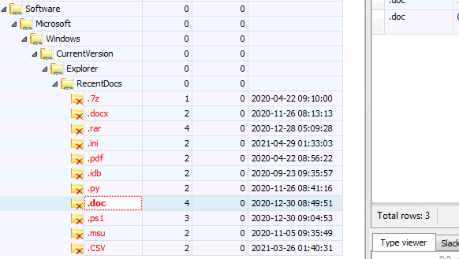

Như trong hình trên, có thể thấy nhiều key có màu đỏ, đó chính là key đã bị xóa, nhưng tại sao ta vẫn có thể xem được chúng. Câu trả lời là registry cũng tương tự với hệ thống tệp, khi xóa đi một key nào đó, nó chỉ là không được phân bổ, tức là lúc này dữ liệu đó được coi là **unlocated data**. Những dữ liệu đó có thể vẫn còn lại khi xóa key, chúng chỉ không còn khi đã bị **wipe** (ghi đè) lên. Vì vậy đôi khi chúng ta có thể vẫn có cơ hội xem được những khóa này.

---

